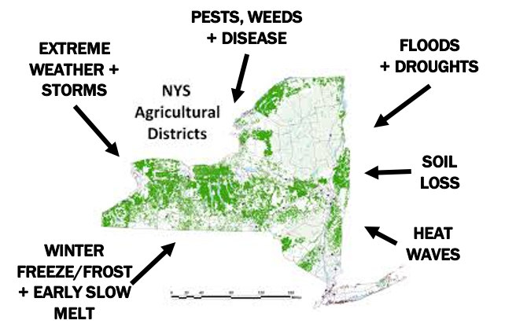
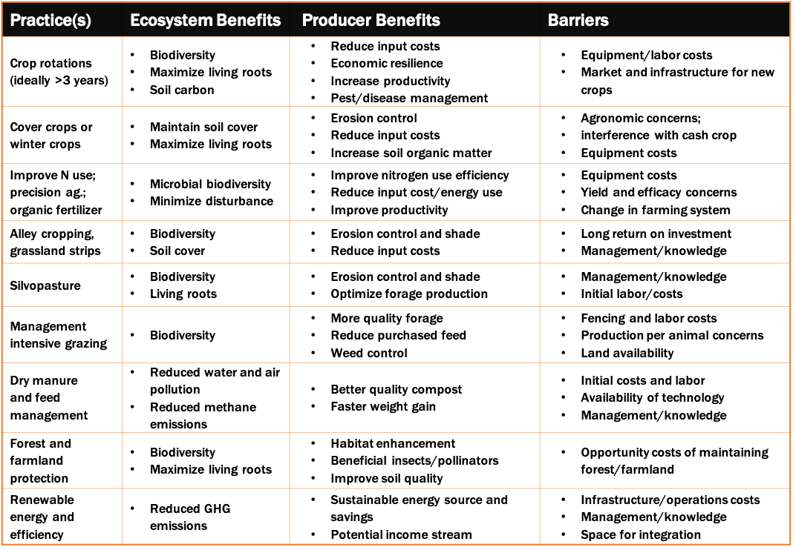

# AGRICULTURE AND CLIMATE INSTABILITY IN NEW YORK: CHALLENGES AND SOLUTIONS

## Protecting farmers from climate instability
Climate change and weather shocks present a severe and immediate threat to New York’s agricultural communities. With a quarter of the state’s land in crops (4.2 million acres) and grazing (2.7 million acres), and 160,000 jobs in NY agriculture, climate instability has a huge impact:
* **Hurricane Irene cost $9.9M in farmland damage repair; extreme storms are more frequent and intense.** 
* **Heat waves and rising temperatures would cost NY dairies $25M in production losses.**
* **Climate instability will also bring new and tougher weeds, pests and diseases, such as Stewart’s wilt and late blight.**
 
 
## Agriculture contributes to climate change in New York 
Excessive fertilizer and animal manure applied to cropland emits nitrous oxide and methane, both very potent greenhouse gases (GHGs) that contribute to climate change. Land conversion and forest clearing releases previously unperturbed plant and soil carbon as carbon dioxide. In addition, every year NY loses many acres of farmland to development, increasing GHG emissions from the land. Altogether, the total cost of food is at least 2.5 times its market price including the hidden costs of environmental and health harms.  Numerous practices have been proven to reduce greenhouse gas emissions while improving farm resilience, productivity and profitability, but have yet to be widely adopted in New York. 

**Practice**| **US Adoption Rate** | **New York Adoption Rate**
------------|----------------------|-----------------------------
Cover crops | 3% of all cropland acres | 5% of all cropland acres
No-till | 25% of all cropland acres | 6% of all cropland acres
Certified organic | <1% of all US farms | 3% of NY farms

## Benefits of climate-friendly farming
Climate-friendly farming practices create healthier soils, which better defend cropland to withstand floods, droughts, heatwaves and pests. Farmers can be among our best stewards of healthy, productive soil. Producer benefits of healthy soil practices, once established, include better yields, reduced input costs, build-up of fertile organic matter, greater resilience to weather impacts and a more diversified income stream. Public benefits include reduced GHG emissions, a more secure food supply, less water and air pollution, and less toxic chemical exposure. If these practices are adopted on a wide-scale, agriculture has the potential to be carbon-neutral and more productive.

## Overcoming barriers to wider adoption of climate-friendly practices
 

## Building momentum for productive and profitable climate-friendly farming
Making the transition from conventional to climate-friendly practices can be a challenging process. Existing NY programs should be revised, and new programs developed to help farmers to surmount these barriers and accelerate the benefits of healthy soils and natural systems:
* **Climate Resilient Farming Program** – $2M per year for manure management, $1M for water quality, and $1M for improving soil health management; should increase funding for long-term transitions to climate-friendly farming. 
* **Clean Water Act** – $15M per year; funds runoff reduction; should focus on long-term adoption of soil health practices.
* **Climate Leadership and Community Protection Act (2019)** – Requires state to promote BMP’s for long-term C sequestration for land-use, agriculture and forestry; requires performance-based standards to reduce GHGs
* **Methane Reduction Plan** – Supports on-farm digesters and improved animal waste management systems; should encourage composting and management intensive grazing.
* **Climate Adaptation Plan** – Sets GHG emission reduction goal; should explicitly address agriculture. 
* **Farm Bill Programs** – Funds disbursed by NRCS; should focus on long-term land preservation and climate-friendly practices, and offer more support such as education, outreach, long-term financial and technical assistance (yield insurance), effective and efficient monitoring. 
* **Proposed Carbon Farming Act (2019)** – Offers farmers a tax credit for using practices with demonstrated GHG and carbon benefits; should include provisions that maintain stored C in existing forestland and high-carbon farmland.
* **Proposed “Healthy Soils” state bills from Earthjustice, NOFA-NY, and Cornell** – Include incentives to support healthy soils such as long-term financial and transition assistance, more education, outreach and technical assistance.

[TEST TABLE]

|                         Practice(s)                       |                              Ecosystem Benefits                            |                                               Producer Benefits                                             |                                            Barriers                                          |   |
|:---------------------------------------------------------:|:--------------------------------------------------------------------------:|:-----------------------------------------------------------------------------------------------------------:|:--------------------------------------------------------------------------------------------:|---|
|     Crop   rotations (ideally >3 years)                   |     • Biodiversity     • Maximize   living roots     • Soil   carbon       |     •Reduce input costs     •Economic resilience     •Increase productivity     •Pest/disease management    |     •Equipment/labor costs     •Market and infrastructure for new crops                      |   |
|     Cover   crops or winter crops                         |     • Maintain   soil cover     • Maximize   living roots                  |     •Erosion control     •Reduce input costs     •Increase soil organic matter                              |     •Agronomic concerns; interference with   cash crop     •Equipment costs                  |   |
|     No-till   and reduced till                            |     • Minimizing   disturbance     • Soil   cover                          |     •Erosion control     •Reduce input/costs, on-farm energy use                                            |     •Agronomic concerns     •Greater herbicide use                                           |   |
|     Improve   N use; precision ag.; organic fertilizer    |     • Microbial   biodiversity     • Minimize   disturbance                |     •Improve nitrogen use efficiency     •Reduce input cost/energy use     •Improve productivity            |     •Equipment costs     •Yield and efficacy concerns     •Change in farming system          |   |
|     Alley   cropping, grassland strips                    |     • Biodiversity     • Soil   cover                                      |     •Erosion control and shade     •Reduce input costs                                                      |     •Long return on investment     •Management/knowledge                                     |   |
|     Silvopasture                                          |     • Biodiversity     • Living   roots                                    |     •Erosion control and shade     •Optimize forage production                                              |     •Management/knowledge     •Initial labor/costs                                           |   |
|     Management   intensive grazing                        |     • Biodiversity                                                         |     •More quality forage      •Reduce purchased feed     •Weed control                                      |     •Fencing and labor costs     •Production per animal concerns     •Land availability      |   |
|     Dry   manure      and   feed management   *           |     •Reduced   water and air pollution     •Reduced   methane emissions    |     •Better quality compost     •Faster weight gain                                                         |     •Initial costs and labor     •Availability of technology     •Management/knowledge       |   |
|     Forest   and farmland protection *                    |     •Biodiversity     •Maximize   living roots                             |     •Habitat enhancement     •Beneficial insects/pollinators     •Improve soil quality                      |     •Opportunity costs of maintaining   forest/farmland                                      |   |
|     Renewable   energy and efficiency *                   |     •Reduced   GHG emissions                                               |     •Sustainable energy source and savings     •Potential income stream                                     |     •Infrastructure/operations costs     •Management/knowledge     •Space for integration    |   |
